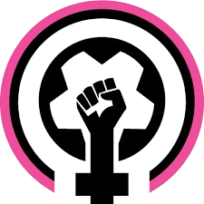

# Copa Passa Bola 2025

<div align="center">
  
  
  **Quebrando Barreiras no Campo e na Vida**
  
  [](https://nextjs.org/)
  [](https://reactjs.org/)
  [](https://www.typescriptlang.org/)
  [](https://tailwindcss.com/)
  [](https://www.framer.com/motion/)
</div>

---

## Sobre o Projeto

A **Copa Passa Bola** é mais que um torneio de futebol feminino — é um **movimento revolucionário** que celebra a força, resistência e talento das mulheres no esporte. Fundada em 2020, nossa plataforma digital representa o coração tecnológico desta iniciativa transformadora.

### Missão
Quebrar barreiras no futebol feminino, promovendo igualdade, inclusão e empoderamento através do esporte e da tecnologia.

### Visão
Ser a principal plataforma digital para o futebol feminino brasileiro, conectando atletas, apoiadores e comunidades em um movimento de transformação social.

---

## Principais Funcionalidades

### Sistema de Inscrições Inteligente
- **Cadastro Individual & Times**: Sistema duplo para atletas solo e equipes completas
- **Validação em Tempo Real**: Formulários inteligentes com validação instantânea
- **Upload de Documentos**: Sistema seguro de upload com preview e validação
- **Gestão de Jogadoras**: Interface intuitiva para gerenciar membros do time

### E-commerce Integrado
- **Loja Oficial**: Produtos exclusivos da Copa Passa Bola
- **Carrinho Inteligente**: Sistema de carrinho com persistência local
- **Filtros Avançados**: Busca por categoria, preço e disponibilidade
- **Checkout Seguro**: Processo de compra otimizado e seguro

### Plataforma de Doações
- **Doações Flexíveis**: Múltiplas opções de valores e frequência
- **PIX & Cartão**: Integração com principais meios de pagamento
- **Transparência Total**: Acompanhamento do impacto das doações
- **Doações Anônimas**: Opção de privacidade para doadores

### Portal de Voluntariado
- **Oportunidades Diversas**: Desde organização até cobertura midiática
- **Gestão de Perfis**: Sistema completo de cadastro de voluntários
- **Matching Inteligente**: Conecta voluntários com oportunidades ideais
- **Acompanhamento**: Dashboard para voluntários ativos

---

## Stack Tecnológica

### Frontend Moderno
```typescript
// Core Framework
Next.js 14.0          // React Framework com SSR/SSG
React 18.2            // Biblioteca UI reativa
TypeScript 5.0        // Tipagem estática avançada

// Styling & UI
Tailwind CSS 3.4      // Framework CSS utilitário
Radix UI              // Componentes acessíveis
Framer Motion 12.16   // Animações fluidas
Lucide React          // Ícones modernos

// Forms & Validation
React Hook Form 7.54  // Gerenciamento de formulários
Zod 3.24             // Validação de schemas
@hookform/resolvers   // Integração RHF + Zod

// State & Context
React Context API     // Gerenciamento de estado global
Custom Hooks          // Lógica reutilizável
```

### Características Avançadas
- **Design System**: Componentes reutilizáveis e consistentes
- **Responsivo**: Mobile-first, otimizado para todos os dispositivos
- **Dark Mode**: Alternância automática e manual de temas
- **Performance**: Otimizações SSR, lazy loading e code splitting
- **Acessibilidade**: WCAG 2.1 AA compliant
- **SEO**: Meta tags otimizadas e structured data

---

## Instalação e Configuração

### Pré-requisitos

**Node.js >= 18.0.0**
```bash
# Windows (usando winget)
winget install OpenJS.NodeJS

# Windows (usando Chocolatey)
choco install nodejs

# macOS (usando Homebrew)
brew install node@18

# Linux (Ubuntu/Debian)
curl -fsSL https://deb.nodesource.com/setup_18.x | sudo -E bash -
sudo apt-get install -y nodejs

# Verificar instalação
node --version
npm --version
```

**pnpm >= 8.0.0 (Gerenciador de Pacotes Recomendado)**
```bash
# Instalar pnpm globalmente
npm install -g pnpm

# Ou usando script oficial
curl -fsSL https://get.pnpm.io/install.sh | sh -

# Windows (PowerShell)
iwr https://get.pnpm.io/install.ps1 -useb | iex

# Verificar instalação
pnpm --version
```

### Instalação Rápida
```bash
# Clone o repositório
git clone https://github.com/sys0xFF/challange-passabola.git
cd challange-passabola

# Instale as dependências
pnpm install

# Execute em modo de desenvolvimento
pnpm dev
```

### Scripts Disponíveis
```bash
pnpm dev          # Servidor de desenvolvimento
pnpm build        # Build de produção
pnpm start        # Servidor de produção
pnpm lint         # Verificação de código
```

---

## Arquitetura do Projeto

```
copa-passa-bola/
├── app/                      # App Router (Next.js 14)
│   ├── page.tsx             # Landing page principal
│   ├── cadastro/            # Sistema de inscrições
│   ├── loja/                # E-commerce
│   ├── doacao/              # Plataforma de doações
│   ├── voluntaria/          # Portal de voluntariado
│   ├── historia/            # Nossa história
│   ├── contato/             # Formulário de contato
│   ├── carrinho/            # Carrinho de compras
│   └── checkout/            # Finalização de compras
├── components/              # Componentes reutilizáveis
│   ├── animations/          # Componentes de animação
│   └── ui/                  # Design system
├── contexts/                # Contextos React
├── hooks/                   # Custom hooks
├── lib/                     # Utilitários e helpers
├── public/                  # Assets estáticos
└── styles/                  # Estilos globais
```

---

## Design System

### Paleta de Cores
```css
/* Cores Primárias */
--primary: #8e44ad        /* Roxo vibrante */
--secondary: #c2ff28      /* Verde néon */
--accent: #ff6b9d         /* Rosa energético */

/* Cores de Sistema */
--background: #ffffff     /* Branco puro */
--foreground: #1a1a1a     /* Quase preto */
--muted: #f8f9fa          /* Cinza claro */
```

### Tipografia
```css
/* Fonte Display */
font-family: 'Bebas Neue'    /* Títulos impactantes */

/* Fonte Sistema */
font-family: 'Inter'         /* Texto corpo legível */
```

---

## Principais Componentes

### Sistema de Formulários
```typescript
// Exemplo: Cadastro de Time
interface TeamRegistrationData {
  nomeTime: string
  responsavel: string
  jogadoras: Player[]
  documentos: File[]
}

// Validação com Zod
const teamSchema = z.object({
  nomeTime: z.string().min(3, "Nome deve ter pelo menos 3 caracteres"),
  responsavel: z.string().min(2, "Nome do responsável obrigatório"),
  // ... mais validações
})
```

### Carrinho de Compras
```typescript
// Context para gerenciamento global
interface CartContextType {
  items: CartItem[]
  addItem: (product: Product) => void
  removeItem: (productId: string) => void
  updateQuantity: (productId: string, quantity: number) => void
  getTotalPrice: () => number
}
```

---

## Segurança e Privacidade

### Medidas de Segurança
- **HTTPS** obrigatório em produção
- **Sanitização** de inputs do usuário
- **Validação** server-side e client-side
- **Upload seguro** de arquivos com verificação de tipo

### Privacidade
- **LGPD** compliant
- **Consentimento** explícito para dados
- **Anonimização** de doações quando solicitado
- **Controle** total sobre dados pessoais

---

## Responsividade

### Breakpoints
```css
/* Mobile First */
sm: 640px    /* Tablets pequenos */
md: 768px    /* Tablets */
lg: 1024px   /* Desktops */
xl: 1280px   /* Desktops grandes */
2xl: 1536px  /* Ultra-wide */
```

### Otimizações Mobile
- **Touch-friendly** interfaces
- **Gestos** nativos suportados
- **PWA** ready para instalação
- **Offline** functionality básica

---

## Licença

Este projeto está licenciado sob a **MIT License** - veja o arquivo [LICENSE](LICENSE) para detalhes.

---

<div align="center">
  <h3>Feito com amor para o futebol feminino brasileiro</h3>
  
  **Juntas somos mais fortes!**
  
  [](https://nextjs.org/)
</div>
